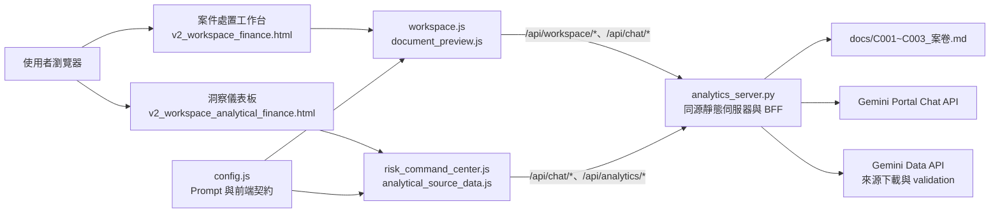
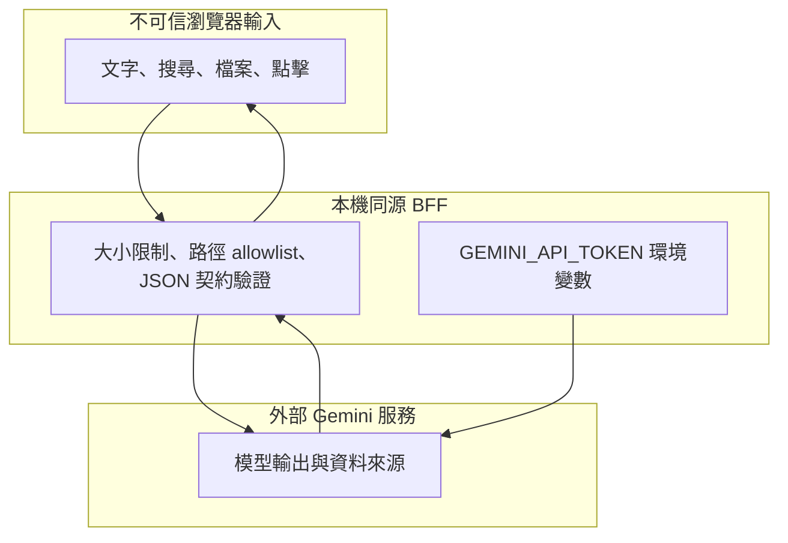
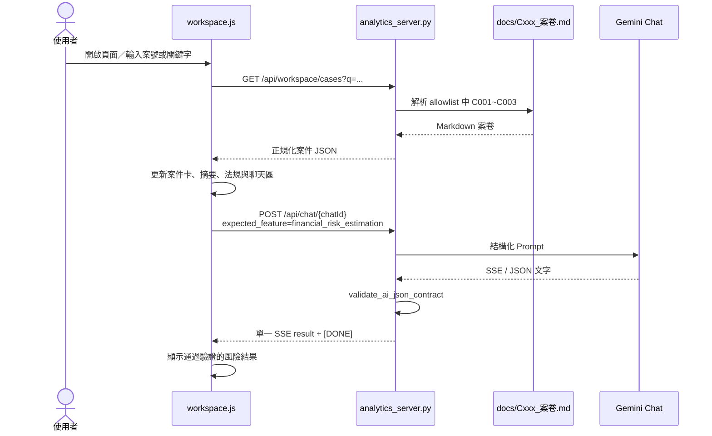

# Compliance Genie 架構、運作邏輯與交付治理書

> 本文件是本專案的架構事實來源（Architecture Source of Truth）。所有人類與 AI 在修改程式前，必須先閱讀本文件與 [`docs/AI_PROGRESS_TRACKER.md`](docs/AI_PROGRESS_TRACKER.md)。

## 0. 文件控制

| 欄位 | 內容 |
|---|---|
| 文件版本 | 2.0.0 |
| 基準日期 | 2026-08-06（Asia/Taipei） |
| 基準分支 | `milestone/live-gemini-finance-workspace-2026-08-05` |
| 基準 HEAD | `60a4d90294a991197a8edd95de0bc6616defb3df` |
| 系統型態 | 靜態前端 + Python 同源 BFF + Gemini Data / Chat API |
| 主要使用者 | 金融機構合規、法務、風險管理人員 |
| 維護方式 | 架構書記錄穩定設計；進度表記錄動態工作與 Commit 證據 |

### 狀態詞彙

| 狀態 | 定義 |
|---|---|
| `已實作` | 程式碼中存在可執行路徑，但不代表已通過測試 |
| `部分實作` | 主流程存在，仍有 fallback、缺少錯誤處理或功能不完整 |
| `未實作` | 只有 UI、文字、設計或構想，沒有可完成目標的程式路徑 |
| `已驗證` | 有可重現的測試命令、結果、日期與適用範圍 |
| `待驗證` | 尚未執行，或需要外部服務／人工瀏覽器驗證 |
| `阻塞` | 已知外部依賴或決策使工作無法繼續 |
| `已解決` | 同時符合驗收條件、測試證據及可追溯 Commit；不能只靠口頭宣告 |

## 1. 系統目標與邊界

Compliance Genie 提供兩個工作介面：

1. **案件處置工作台**：載入案卷、上傳文件、查詢法規、向 Gemini Chat 提問、顯示風險估算與匯出案件報告。
2. **交叉分析與洞察儀表板**：以允許清單中的資料來源及 Gemini Chat 產生企業風險摘要、KPI、異常訊號、治理建議與助理回覆。

目前專案是單機展示／原型架構，不是可直接上線的多使用者正式系統。它沒有自己的資料庫、身分驗證、權限模型、背景工作佇列、正式稽核軌跡與部署組態。

### 不應誤解為已具備的能力

- AI 產生的法律判斷不是最終法律意見，重要決策必須人工覆核。
- 顯示「來源」不等於引證內容已經逐句核實。
- 前端下載的 Markdown 或瀏覽器列印不是正式文件簽核流程。
- BFF 的 allowlist、大小限制與 JSON 驗證是基本防護，不等於完整的生產安全控制。

## 2. 系統全貌



### 信任邊界



模型輸出與外部 CSV 都必須視為不可信資料。結構化 UI 只能使用通過 schema 驗證的 JSON；使用者可見的法律與金額結論仍須保留人工覆核提示。

## 3. Repository 結構與責任

| 路徑 | 責任 | 現況 |
|---|---|---|
| `index.html` | 首頁與工作台導覽 | 已實作，待瀏覽器回歸 |
| `pages/v2_workspace_finance.html` | 單一案件 UI 骨架 | 已實作 |
| `pages/v2_workspace_analytical_finance.html` | 主管洞察 UI 骨架 | 已實作 |
| `analytics_server.py` | 靜態檔案、案件解析、Chat/Data 代理、上傳、validation、輸出驗證 | 已實作展示版 BFF |
| `js/config.js` | API 常數、Prompt templates、前端 JSON 契約驗證 | 已實作；仍含前端展示 JWT，屬高風險待移除項目 |
| `js/workspace.js` | 案件搜尋、載入、上傳、聊天、風險呈現、Markdown 匯出 | 部分實作；存在 legacy/fallback 路徑 |
| `js/risk_command_center.js` | 儀表板載入、深鑽、助理、報告動作 | 部分實作；仍存在靜態 legacy 定義 |
| `js/document_preview.js` | 結構化文件生成、預覽與列印 | 已實作，待端到端驗證 |
| `js/api.js` | 舊版可注入的 Chat polling service | 已測試，但目前主要頁面未載入，屬待整併架構 |
| `js/analytical_source_data.js` | 儀表板來源 catalog / snapshot 描述 | 已實作，需與後端 allowlist 同步維護 |
| `docs/C001_案卷.md` ~ `C003_案卷.md` | 本機來源型測試案卷 | 已存在；是目前工作樹新增／更名內容 |
| `docs/gemini_data_API.md` | 上游 API 參考規格 | 參考用；不可取代實際整合測試 |
| `scripts/test_workspace_regressions.py` | BFF 契約、案卷、上傳單元／迴歸測試 | 9 項已驗證 |
| `js/tests/api_polling.test.js` | 舊版 API service 的 8 個情境測試 | 已驗證，但不涵蓋目前完整 UI |
| `scripts/test_proxy_endpoints.py`、`test_c001.py`、`test_validation.py` | 需本機服務與／或真實 API 的診斷腳本 | 待整合與自動化 |
| `pages/prototypes/`、`js/tests/workspace_*` | 歷史原型／保留版本 | 非正式 runtime；需標示或封存 |

## 4. Runtime 與啟動方式

正式展示路徑應透過同源 BFF，而不是直接以 Live Server 開啟頁面：

```powershell
$env:GEMINI_API_TOKEN = '<token>'
python .\analytics_server.py --host 127.0.0.1 --port 8765 --workspace finance --open
```

或使用 `start_analytical_demo.ps1` / `start_analytical_demo.cmd`。預設網址：

- 案件工作台：`http://127.0.0.1:8765/pages/v2_workspace_finance.html`
- 洞察儀表板：`http://127.0.0.1:8765/pages/v2_workspace_analytical_finance.html`
- 健康檢查：`http://127.0.0.1:8765/api/health`

`GEMINI_API_TOKEN` 應只存在後端環境變數。啟動腳本目前可能由 `js/config.js` 取展示憑證，這是暫時相容行為，不是正式安全設計。

## 5. 核心運作邏輯

### 5.1 BFF 啟動與靜態服務

1. `analytics_server.py` 建立 `ThreadingHTTPServer`。
2. `DashboardHandler` 以 repository root 作為靜態檔案目錄。
3. `/api/*` 由 BFF 處理；其他路徑交由 `SimpleHTTPRequestHandler`。
4. 依 `--workspace analytical|finance` 決定自動開啟的頁面。

目前沒有 TLS、登入、session cookie 或 CSRF 防護，因此只應綁定可信的本機介面；不得直接暴露到公網。

### 5.2 案件載入與搜尋



後端只解析 `WORKSPACE_CASE_FILES` 中列出的本機案卷，不接受使用者用 query 指定任意檔案路徑。若 `/api/workspace/cases` 失敗，前端仍有直接讀取固定 Markdown 的 fallback；此路徑需保留明確錯誤提示，不能被描述成後端已驗證資料。

### 5.3 Chat session 與結構化問答

1. 前端呼叫 `GET /api/chat/session`。
2. BFF 取得 `/assistant/chat/list`，優先選標題為 `Compliance Genie 工作台` 的聊天室，否則選快取 ID 或清單第一筆。
3. 前端以 `POST /api/chat/{chatId}` 傳送 `q`、`streaming` 與可選 `expected_feature`。
4. BFF 僅允許向目前選中的聊天室提問。
5. BFF 讀取上游 SSE，取得 `result` 與 message IDs，再讀歷史訊息作備援。
6. 若指定 `expected_feature`，BFF 驗證 schema version、feature、status、warnings 與各功能必要欄位。
7. BFF 將最終結果包成單一 SSE event 回傳前端。

注意：此 BFF 目前不是逐 token 轉送；它會先讀完上游內容再回傳一個結果，所以 UI 所稱「串流」不等於真正即時 token streaming。

### 5.4 檔案上傳與知識庫登錄

1. UI 接受檔案並以原始檔案 bytes POST 至 `/api/workspace/knowledge`，檔名放在 `X-Upload-File-Name`。
2. BFF 限制 request body 為 10 MB，清理 `X-Upload-File-Name` 為 basename。
3. SaaS 環境先 POST `/import/uploads/signed-url` 取得 `signedUrl` 與 `uploadId`；`/import/uploads` 僅供 On-premise，SaaS 會回覆 405。
4. BFF 以未夾帶 Gemini API 憑證的 PUT 將原始檔案寫入 `signedUrl`；缺少 `signedUrl` 或 `uploadId` 時停止。
5. BFF 以 `uploadId` 作為 `file_path`，再呼叫 `/import/vector/knowledge` 登錄知識庫。
6. 只有儲存與知識庫登錄都成功時，UI 才建立暫時案件上下文並觸發分析；任一步失敗均停止後續 AI 分析。

若 `/import/vector/knowledge` 明確回覆 401/403（缺少 `source:write`），BFF 不會宣稱已寫入知識庫，而會改以本機 `pypdf`／UTF-8 文字擷取建立單次案件上下文。文字型 PDF 可分析；沒有文字層的掃描 PDF 會明確要求 OCR。其他網路錯誤或格式錯誤仍維持失敗，不會任意降級。

尚未實作可靠的 MIME sniffing、惡意檔掃描、上傳工作狀態查詢、刪除／回復、資料保留政策與租戶層授權。

### 5.5 洞察儀表板

1. 頁面載入時直接 GET `/api/dashboard/overview`；主儀表板不依賴 Chat 回覆。
2. BFF 讀取 allowlist 的 11 個 Gemini Data Source，逐一驗證爭議類型或公司統計 schema。
3. 聚合層只計算可驗證的外部申訴件數、評議件數、合計與來源覆蓋率；不產生企業風險分數、內部 SLA、監理缺口、財務曝險或個案排名。
4. 單一來源失敗時回傳 `partial` 與 `source_errors`，成功來源仍可顯示；全部失敗時使用記憶體中的 Last Known Good，並標示 `cache_status=last_known_good`。
5. 原始 Source endpoint `/api/analytics/sources/{sourceId}` 仍提供個別外部 benchmark；CSV 上限為 5 MB／5,000 rows，單一來源快取 60 秒。
6. Chat session 僅供 Genie 助理讀取已驗證的 Dashboard JSON 進行說明，不參與主 KPI 計算或頁面啟動條件。

### 5.6 Validation 來源

`GET /api/v1/chat/{chatId}/{messageId}/validation` 代理 Gemini Data API；`messageId=latest` 時會從聊天室歷史找最後一則 AI 訊息。這個功能已接到工作台 UI，但真實 upstream endpoint、回傳結構、來源預覽與錯誤狀態仍待端到端驗證。

### 5.7 文件與報告輸出

- 案件工作台 `triggerExport()` 會組合目前畫面資料並下載 Markdown。
- `document_preview.js` 會要求 `document_generation` JSON，建立預覽並呼叫 `window.print()`。
- 洞察儀表板 `generateReport()` 目前主要是 UI 進度／預覽流程，尚不能視為正式管理報告交付。

尚未具備：伺服器端 PDF、固定版型、電子簽核、文件版本、不可否認性、附件封存、來源快照與報告雜湊。

## 6. BFF API 契約

| 方法與路徑 | 用途 | 輸入限制 | 輸出／狀態 |
|---|---|---|---|
| `GET /api/health` | 服務與 token 狀態 | 無 | `status`、`api_base`、`token_configured`；已實作 |
| `GET /api/workspace/cases?q=` | 讀取／搜尋案卷 | 空查詢回傳本機 C001/C002；案號未命中時查 Gemini Case Source，並驗證 14 欄 schema | 案件 JSON；C003 單元與真實 HTTP 已覆蓋 |
| `GET /api/dashboard/overview` | 聚合正式外部統計 | 11 個 ID allowlist；逐來源 schema 驗證 | `dashboard_source_overview`、部分失敗、Last Known Good；已實作 |
| `GET /api/chat/session` | 選取共享工作台聊天室 | 需要後端 token | live session；待真實環境驗證 |
| `GET /api/analytics/sources/{id}` | 取得允許來源 CSV | 11 個 ID allowlist、5 MB、5,000 rows | 正規化 rows + 60 秒 cache；待真實環境驗證 |
| `GET /api/v1/chat/{chat}/{message}/validation` | 代理訊息來源驗證 | chat/message path encoding | 上游 JSON；待真實環境驗證 |
| `POST /api/workspace/knowledge` | 上傳並登錄知識庫 | 原始檔案 body、1~10 MB | 有權限時回傳 storage/knowledge；401/403 時回傳 `local_only` 與本地擷取文字 |
| `POST /api/chat/{chatId}` | 提問與可選 JSON 驗證 | JSON body 1~2 MB | 單一 SSE result；契約測試為部分覆蓋 |

### 結構化 AI 功能名稱

`case_lookup`、`financial_risk_estimation`、`case_assistant`、`dashboard_overview`、`dashboard_insight`、`dashboard_assistant`、`document_generation`。

所有新功能若要驅動結構化 UI，必須：

1. 在 `config.js` 定義 schema 與 prompt。
2. 在前後端驗證器加入一致的 feature 與必要欄位。
3. 加入成功、缺欄、錯誤型別、`insufficient_data` 測試。
4. UI 對 null／缺資料顯示「資料不足」，不得合成看似真實的值。

## 7. 資料來源與狀態

| 資料 | 真實來源 | 儲存位置 | 可信度處理 |
|---|---|---|---|
| C001/C002 案件 | repository Markdown | `docs/` | 可追 Git；內容正確性仍需業務覆核 |
| C003 等非模板案件 | Gemini `case-node` CSV Source | BFF 60 秒記憶體 cache | 逐欄驗證 Case schema；不以 AI 補值 |
| 使用者上傳案卷 | Gemini upload / vector knowledge；403 時本地文字層 | 外部服務或單次請求記憶體 | 本地模式不宣稱已向量化；掃描 PDF 需 OCR |
| Chat 回覆 | Gemini Portal Chat | 外部聊天室 | 結構驗證不等於事實驗證 |
| 儀表板 CSV | 11 個 Gemini sources | BFF 60 秒記憶體 cache | 有 allowlist/schema/row 限制 |
| 前端 UI 狀態 | DOM 與 JS 記憶體 | 瀏覽器頁面生命週期 | 重新整理即消失 |
| 報告 | Markdown download／列印 | 使用者裝置 | 尚無伺服器保存與版本控管 |

目前多個功能共用同一個聊天室，存在並行請求互相干擾、歷史訊息污染與跨使用者隔離不足的風險。正式版應改為每使用者／案件／任務獨立 session，並由後端驗證所有權。

## 8. 安全、隱私與合規風險

### P0

- `js/config.js` 含可讀取的展示 JWT。必須撤銷／輪替，移除前端 token 與啟動腳本 fallback，並以 secret 管理注入後端。
- BFF 沒有使用者認證與授權；不可部署到不可信網路。
- Chat session 為共享選取邏輯，沒有案件／使用者資料隔離。
- legacy 靜態風險數字與回覆可能被誤認為 live data，必須刪除或明確隔離到不會打包的 fixture。

### P1

- 上傳只做大小與基本檔名處理，缺少 MIME 驗證、惡意內容掃描、配額、刪除與 retention。
- 未設定 CSP、HSTS、frame ancestors 等正式 Web 安全標頭。
- log、Prompt、下載報告可能包含個資；缺少遮罩與稽核政策。
- 上游 timeout/retry/circuit breaker、rate limit 與 observability 不完整。

### P2

- Google Fonts 為第三方網路依賴，離線與隱私環境需自託管。
- 前端有大量 inline handler / style，增加 CSP 與維護成本。

## 9. 實作與驗證矩陣（2026-08-06）

| 編號 | 能力 | 實作 | 驗證 | 證據／缺口 |
|---|---|---|---|---|
| CG-001 | 本機 BFF 與靜態頁面 | 已實作 | 部分驗證 | `python -m py_compile analytics_server.py` 通過；未做瀏覽器 E2E |
| CG-002 | 固定案卷解析與搜尋 | 已實作 | 已驗證（單元） | `test_workspace_regressions` 涵蓋 C001、C003、關鍵字 |
| CG-003 | 上傳兩階段登錄 | 已實作 | 部分驗證 | mock upstream 成功／缺 path；真實 PDF/CSV 尚未驗證 |
| CG-004 | Chat session 與 SSE 包裝 | 已實作 | 待驗證 | 需有效 token 與真實聊天室 |
| CG-005 | 財務風險 JSON 契約 | 已實作 | 部分驗證 | 缺少監理評估會拒絕；真實模型穩定性待驗證 |
| CG-006 | 儀表板 overview | 部分實作 | 待驗證 | parser 有單元測試；完整 UI/API 未驗證 |
| CG-007 | 外部 11 sources | 已實作 | 待驗證 | allowlist/schema 存在；需逐來源驗證 |
| CG-008 | KPI 深鑽與助理 | 部分實作 | 待驗證 | 仍有 legacy 靜態內容 |
| CG-009 | Validation 來源預覽 | 部分實作 | 待驗證 | 診斷腳本存在但未納入自動測試 |
| CG-010 | 案件 Markdown 匯出 | 已實作 | 待人工驗證 | 需檢查內容、編碼、來源與下載檔名 |
| CG-011 | 文件生成／列印 | 部分實作 | 待驗證 | 不等於正式 PDF 交付 |
| CG-012 | 正式認證、權限與稽核 | 未實作 | 未驗證 | 上線阻擋項目 |
| CG-013 | CI pipeline | 未實作／未發現 | 未驗證 | repository 未見 GitHub Actions workflow |
| CG-014 | 自動化瀏覽器 E2E | 未實作 | 未驗證 | 需涵蓋兩個主要頁面與錯誤路徑 |

### 本次已執行的測試

| 日期 | 命令 | 結果 | 涵蓋範圍 |
|---|---|---|---|
| 2026-08-06 | `python -m unittest scripts.test_workspace_regressions -v` | PASS，9/9 | 案卷解析、搜尋、上傳 mock、dashboard parser、財務風險契約 |
| 2026-08-06 | `node --test js/tests/api_polling.test.js` | PASS，8 個腳本情境；Node runner 顯示 1 test file | 舊版 `js/api.js` 的 chat/polling DI 邏輯 |
| 2026-08-06 | `python -m py_compile analytics_server.py` | PASS | Python 語法，不代表 runtime 正確 |

尚未執行 `scripts/test_proxy_endpoints.py`、`scripts/test_c001.py`、`scripts/test_validation.py`，因為它們需要啟動本機服務及有效外部憑證，且目前不是隔離、可重現的自動測試。

## 10. 尚未實作／尚未驗證工作清單

| 優先級 | 追蹤 ID | 工作 | 完成條件摘要 |
|---|---|---|---|
| P0 | CG-SEC-001 | 移除並撤銷前端 JWT | repo 搜尋無 token；後端只讀 secret；舊 token 已輪替；啟動與測試通過 |
| P0 | CG-DATA-001 | 移除 runtime legacy/mock/fallback 假數據 | 正式 JS 無靜態 KPI／法律結論／假回覆；失敗只顯示錯誤或資料不足 |
| P0 | CG-AUTH-001 | 定義正式認證與案件隔離 | 有 threat model、權限檢查、session ownership 與負向測試 |
| P1 | CG-API-001 | 統一 `js/api.js`、BFF 與頁面 API 架構 | 只有一套正式 client；dead path 移除；契約測試涵蓋現行路徑 |
| P1 | CG-E2E-001 | 建立瀏覽器 E2E | 兩頁 happy/error path 在 CI 可重現 |
| P1 | CG-CI-001 | 建立 GitHub Actions | PR 自動跑 Python、JS、靜態檢查；結果可追溯 |
| P1 | CG-VAL-001 | 驗證 validation 與 11 sources | 每個來源記錄 status/schema/sample date；錯誤 UI 已測 |
| P1 | CG-UPLOAD-001 | 強化上傳治理 | MIME、掃描、配額、刪除、retention、權限與測試齊備 |
| P1 | CG-REPORT-001 | 正式報告產製 | 版型、來源快照、版本、review/sign-off、輸出測試齊備 |
| P2 | CG-OBS-001 | 日誌、metrics、trace、錯誤 ID | 不洩漏個資且可定位一次請求 |
| P2 | CG-DOC-001 | 清理 README 與舊原型 | 文件與 runtime 一致；prototype 明確封存 |

詳細負責人、進度、驗證與 Commit 填在 `docs/AI_PROGRESS_TRACKER.md`，不可只改本表的狀態。

## 11. AI／人類共同協作規則

### 開始工作前

1. 閱讀本文件、進度表、`README.md` 與相關程式。
2. 執行 `git status --short`，不得覆蓋或順手提交他人的變更。
3. 在進度表取得或建立唯一追蹤 ID；同一問題不得另開重複 ID。
4. 將狀態改為 `進行中`，記錄負責者、分支、開始時間與預計驗證。
5. 若文件與程式不一致，以可測試的程式現況為調查依據，並同步修正文檔。

### 修改期間

- 一個 Commit 應集中解決一個追蹤 ID；不可把無關格式化或別人的修改一起提交。
- 不可將 AI 推測、fallback 或人工填值包裝成真實資料。
- 不可在前端、測試輸出、文件或 Commit message 放 secret／個資。
- 若改 API、資料契約、架構或安全邊界，必須同一 PR 更新本文件。
- 測試失敗要記錄實際失敗，不得改成「大致通過」。

### 「已解決」Definition of Done

每個項目必須同時具備：

1. 驗收條件逐項通過。
2. 自動測試通過；若只能人工驗證，需列出步驟、環境與結果。
3. 相關文件已更新。
4. 沒有新增明文 secret、假資料或已知高風險 regression。
5. 有本機 Commit SHA；若要求團隊共享，該 Commit 已 push 到 GitHub 可存取分支。
6. 進度表新增「哪個 Commit 解決什麼」以及測試證據。
7. 由非實作者或指定使用者完成驗收；未驗收只能標為 `待驗收`，不能標 `已解決`。

### 使用者回報格式

```text
[RESOLVED]
Issue: CG-XXX-000
Commit: <40-char SHA>
Branch/PR: <branch or PR URL>
解決內容: <具體說明，不使用「已修好」等模糊描述>
驗證命令: <exact command>
驗證結果: <PASS/FAIL + counts>
人工驗收: <驗收者、日期、環境；尚未驗收則寫 pending>
殘餘風險: <none 或具體項目>
```

AI 收到此回報後必須先以 `git show <SHA>`、測試結果與驗收條件核對，再更新進度表；不能只憑訊息把工作關閉。

## 12. Commit 與 GitHub 追蹤規範

### Commit message

```text
<type>(<scope>): <summary> [CG-XXX-000]

Why: <問題與風險>
What: <實際變更>
Verify: <命令與結果>
```

建議 type：`feat`、`fix`、`test`、`docs`、`refactor`、`security`、`chore`。

### 進度表的 Commit ledger 是必要紀錄

每個解決 Commit 都要記錄完整 SHA、日期、追蹤 ID、解決內容、驗證證據、PR／分支與驗收者。一個 Issue 可有多個 Commit；一個 Commit 若真的跨多項工作，必須逐項寫明，不能只列 SHA。

### 目前可從 Git 歷史確認的近期基準

| Commit | Git message 所述解決內容 | 本文件判定 |
|---|---|---|
| `60a4d90294a991197a8edd95de0bc6616defb3df` | 修復 finance workspace Gemini chat layout | 已提交；目前工作樹後續又有修改，需重跑 UI 驗收 |
| `8d83afba5ccf671287cbaeca43e49f20c28ce952` | 保留分析頁 layout 並接 live Gemini API | 已提交；目前仍有 legacy data，不能據此宣告零假資料完成 |
| `5486064ca039dd9411f642dade3f9fca6c5e6be1` | 重寫舊架構文件 | 已提交；已由本版文件取代 |
| `fc58cf91e42343504ec3b21aa5e9804dfb297013` | 擴增 `js/api.js` 測試 | 2026-08-06 重跑通過 |
| `2fb48e2f2717f49e74709f88f7eaa372c710cfc6` | 移除 HTML 寫死數字與 mock 字樣 | 已提交；僅代表該 Commit 範圍 |
| `b2f5dd9e84bfd5b4335838a986efa6de0dbdda1b` | 移除 `risk_command_center.js` 假資料 | 歷史 Commit 曾完成，但目前工作樹再次存在靜態 legacy 定義，視為 regression 待處理 |
| `7000f18999aa5422395fcd1d01da4e7477e07708` | 集中 dashboard prompts | 已提交；目前 prompts 已再擴充 |
| `fd29566d380c9cb612031ede75c317bb627d7edf` | 重寫可測試 API service | 已提交且測試通過；現行頁面架構待整併 |

Commit message 是變更者的主張，不是永久有效的現況證明。後續修改可能造成 regression，因此進度必須同時看 HEAD、工作樹、測試與人工驗收。

## 13. 架構決策與變更規則

### 目前決策

| ADR | 決策 | 理由 | 待辦 |
|---|---|---|---|
| ADR-001 | 使用 Python stdlib BFF 提供同源代理 | 展示環境零框架依賴、避免瀏覽器 CORS 與 token 暴露 | 正式部署前評估 production framework/gateway |
| ADR-002 | 結構化 UI 僅接受版本化 JSON 契約 | 降低自由文字直接驅動畫面的風險 | 建立正式 JSON Schema 與 contract tests |
| ADR-003 | Data source 使用後端 allowlist | 防止任意 source 存取 | 將前後端 catalog 產生自單一設定 |
| ADR-004 | 缺資料時顯示未知，不補假數字 | 合規／財務畫面不可偽造精確度 | 移除殘留 legacy/fallback |
| ADR-005 | 架構書與進度 ledger 分離 | 穩定設計和高頻狀態有不同維護週期 | PR template / CI 檢查尚未實作 |

重大決策需新增 ADR 編號、日期、背景、選項、決策、後果與取代關係。不得只在聊天中決定後不留 repository 紀錄。

## 14. 發布前最低檢查

```powershell
python -m py_compile analytics_server.py
python -m unittest scripts.test_workspace_regressions -v
node --test js/tests/api_polling.test.js
git diff --check
git status --short
```

另需在受控測試環境人工驗證：兩個主要頁面、無 token 錯誤、有效 token 啟動、案件搜尋、C001~C003、Chat、上傳、validation、11 sources、報告輸出、重新整理、網路錯誤與多次快速操作。測試用資料不得包含真實客戶個資。

---

本文件描述的是 2026-08-06 工作樹所見架構。任何「已完成」「已上線」「零假資料」聲明，都必須回到進度表、Commit 與測試證據核對。
