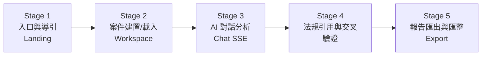
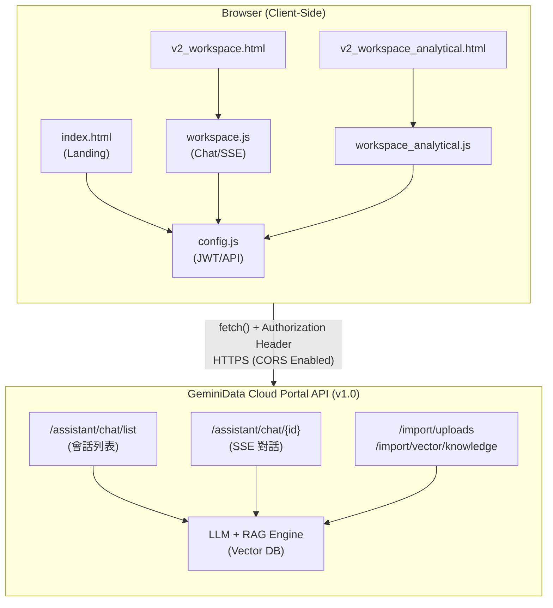

# 合規精靈 Compliance Genie — 設計介面與技術規格文件

> **文件版本**：v2.0  
> **系統定位**：結合 LLM 與 RAG 知識庫的金融消費爭議 AI 合規輔助系統  
> **架構模式**：Pure Frontend Architecture — 瀏覽器直連雲端 Portal API  
> **最後更新**：2026-07-27

---

## 一、使用者操作流程與互動設計 (User Flow & UI Design)

### 1.1 目標使用者

本系統的核心使用者為金融機構內部的**合規人員**與**法務專員**，其日常工作涉及金融消費爭議案件之調查、法規引用、適法性分析及報告撰寫。系統目標是將上述流程從「人工查找 → 逐條比對 → 手動撰稿」的線性耗時模式，轉化為「AI 自動檢索 → 即時引法 → 一鍵生成報告」的智慧協作模式。

### 1.2 核心操作階段

使用者進入系統後的操作軌跡分為**五大階段**，每個階段對應獨立的 UI 元件與 API 呼叫：



#### Stage 1：入口與導引 (Landing Page)

使用者透過 `index.html` 進入系統品牌首頁。頁面以全畫面品牌動態光暈效果（Ambient Orb）搭配漸層 CTA 按鈕引導使用者進入工作台。此階段無 API 呼叫，純粹用於品牌識別與功能預覽。

#### Stage 2：案件建置 / 載入 (Workspace Initialization)

使用者進入 `v2_workspace.html` 後，系統提供三種案件建立路徑：

| 路徑 | 操作方式 | 技術實現 |
|------|---------|---------|
| **快速帶入** | 點擊預設案件標籤 (如 `C001`、`C002`) | 從前端 `caseDb` 字典即時載入案件結構化資料 |
| **檔案上傳** | 拖曳 PDF/CSV 至 Dropzone 或點選檔案 | 前端解析檔名推斷爭議類型、當事人，動態建立案件物件 |
| **手動建立** | 填寫表單 (當事人/類型/金額/爭議要點) | 表單欄位即時寫入 `caseDb`，觸發搜尋與載入流程 |

案件載入完成後，左側邊欄自動渲染**案件摘要卡片**（案號、當事人、爭議金額、狀態徽章）及**法規引用面板**（可折疊式法條清單，點擊即可將法條名稱自動注入聊天輸入框）。

#### Stage 3：AI 智能對話分析 (Chat with SSE Stream)

載入案件後，系統自動呼叫 `GET /assistant/chat/list` 取得有效 Chat ID，並將案件背景資料注入提示詞中，透過 `POST /assistant/chat/{chatId}` 發送至 LLM。回覆以 SSE 串流方式即時渲染於對話區域，支援 Markdown 格式（表格、粗體、程式碼區塊、引言等）。

使用者可透過以下方式持續互動：
- **自由提問**：在輸入框中直接詢問合規相關問題
- **快捷提示詞**：點擊預設 Quick Prompt 按鈕（如「生成合規報告書」、「分析適法性風險」）
- **法條引用注入**：點擊右側法規面板中的法條，自動生成針對該法條的分析提問

#### Stage 4：跨維度交叉分析與知識圖譜 (Analytical Dashboard)

使用者可透過頂部**分頁膠囊切換器 (Segmented Control)** 無縫切換至 `v2_workspace_analytical.html`，進入巨觀分析視角。此頁面提供：

- **FR-08 敘事性洞察引擎**：AI 自動生成結構化文字摘要，支援 Markdown → Rich Text 即時渲染
- **FR-09 跨維度交叉分析矩陣**：呈現「商品 × 法規 × 風險等級」三維矩陣數據表
- **FR-10 知識探索圖譜**：動態 SVG 關聯圖，展示法條 ⇄ 義務 ⇄ 後果 ⇄ 案例的雙向關聯

#### Stage 5：報告匯出

使用者點擊 Header 區域的「匯出報告」按鈕，系統將當前案件之摘要、引用法條、AI 分析結論打包為結構化 JSON 檔案並觸發瀏覽器下載。

---

## 二、視覺風格與 UI 設計規範 (Design System & Visual Aesthetics)

### 2.1 色彩系統 (Color System)

系統採用**雙主色策略**，以金融產業的權威感與 AI 智能亮點為設計主軸：

| 角色 | 色碼 | CSS 變數 | 設計語意 |
|------|------|---------|---------|
| **主色 Navy Blue** | `#1E3A8A` | `--accent-blue` | 金融權威、合規專業、信任感 |
| **點綴色 Champagne Gold** | `#C5A059` | `--accent-gold` | AI 智慧亮點、高價值標記、重點標示 |
| **深金色** | `#A37E3A` | `--accent-gold-dark` | 活躍態互動反饋 |
| **背景色** | `#F8FAFC` | `--bg-light` | 低對比護眼基底 |
| **卡片底色** | `#FFFFFF` | `--bg-card` | 內容承載區域 |
| **主文字色** | `#1E293B` | `--text-main` | 高可讀性深色文字 |
| **輔助文字色** | `#64748B` | `--text-muted` | 次要資訊、標籤 |

**光暈系統 (Ambient Orb)**：頁面背景放置兩顆大型徑向漸層光球（左側金色、右側藍色），以 `filter: blur()` 與低透明度實現科技感光暈氛圍，不干擾前景內容閱讀。

### 2.2 排版系統 (Typography)

| 用途 | 字體 | 權重 | 來源 |
|------|-----|------|-----|
| **標題與品牌** | `Outfit` | 600-700 | Google Fonts |
| **正文與互動** | `Inter` | 300-600 | Google Fonts |
| **系統回退** | `-apple-system, BlinkMacSystemFont, "Segoe UI", Roboto` | — | 系統原生 |

### 2.3 圓角與間距系統 (Spacing & Radius Tokens)

```css
--radius-sm:   8px;   /* 小型按鈕、標籤 */
--radius-md:   12px;  /* 輸入框、選單 */
--radius-lg:   16px;  /* 卡片、面板 */
--radius-pill:  9999px; /* 膠囊按鈕、徽章 */
--radius-card: 24px;  /* 主要內容區塊 */
--gap:         1.25rem; /* 標準間距 */
```

### 2.4 微互動與進階 UI 設計

| 設計元素 | 實作方式 | 效果說明 |
|---------|---------|---------|
| **無邊框卡片 (Borderless UI)** | `border: 1px solid rgba(0,0,0,0.03)` + `box-shadow` | 極淡邊框搭配柔和陰影，營造浮動層次感 |
| **自動擴增輸入框** | `autoGrow()` 函式監聽 `oninput` 事件 | `textarea` 隨文字行數自動擴增高度（最高 180px），無需捲軸 |
| **Markdown 即時渲染** | `marked.js` 解析引擎 | AI 回覆中的 `**粗體**`、`# 標題`、`\| 表格 \|`、`> 引言`、`` `程式碼` `` 即時轉為 Rich HTML |
| **SSE 打字機效果** | `setInterval` + 字元遞增渲染 | SSE 串流資料於背景累積，前景以每 15ms 前進 3 字元的速率平滑輸出，模擬真人打字 |
| **折疊式法規面板** | `toggleSection()` + CSS `max-height` 過渡 | 點擊標題列可折疊/展開法條清單，動畫時長 300ms |
| **知識圖譜懸停效果** | CSS `transform: scale(1.08)` + `box-shadow` 增強 | 圖譜節點 hover 時微放大並強化陰影，提供互動回饋 |
| **分頁膠囊切換器** | `.segmented-nav` + `.segmented-btn.active` | 頂部置中膠囊以 `backdrop-filter: blur(10px)` 實現毛玻璃效果 |

---

## 三、系統架構與技術堆疊 (Tech Stack & Architecture)

### 3.1 架構總覽

本系統採用**純前端架構 (Pure Frontend Architecture)**，無需部署 Python/Node.js 後端伺服器。瀏覽器端 JavaScript 直接透過 CORS 開放的 RESTful API 與雲端 GeminiData Portal 通訊，實現完整的 AI 對話、知識庫檢索與串流渲染功能。



### 3.2 技術堆疊清單

| 層級 | 技術 | 版本/規格 | 用途 |
|------|------|----------|------|
| **結構** | HTML5 | Semantic Elements | 頁面骨架與語意化標籤 |
| **樣式** | Vanilla CSS | CSS3 + Custom Properties | 設計系統、動畫、響應式佈局 |
| **邏輯** | JavaScript | ES2020+ (async/await, ReadableStream) | API 串接、SSE 解析、DOM 操作 |
| **Markdown** | Marked.js | CDN Latest | AI 回覆 Markdown → HTML 即時渲染 |
| **字型** | Google Fonts | Inter + Outfit | 排版系統 |
| **API** | GeminiData Portal API | v1.0 (RESTful + SSE) | LLM 對話、知識庫管理 |
| **驗證** | JWT (JSON Web Token) | Bearer Token | API 身份鑑權 |

---

### 3.3 模組自述：全域環境與鑑權 (config.js)
**介面位置**：無實體介面 (作為全域背景服務，套用於所有頁面)
**Gemini Data API 引用**：作為所有 API 呼叫的基礎閘道
**功能重點**：設定全域變數 `GEMINI_API_BASE` (`https://cloud.geminidata.com/api/portal/api10`) 與 JWT 認證，透過 `getApiHeaders()` 注入 `Authorization` 與 `x-application-tenant` 確保後續任何 API 呼叫的合法性。

---

### 3.4 模組自述：案件工作台 (v2_workspace.html) - 背景會話初始化區
**介面位置**：進入工作台載入時的背景初始化作業 (不可見)，為後續對話鋪墊。
**Gemini Data API 引用**：`GET /assistant/chat/list` (會話列表)
**功能重點**：
進入 `v2_workspace.html`，系統需要一個有效的 Chat ID 才能與 LLM 互動。系統在背景發送請求取得最新的會話 ID 並存入快取 `activeChatId`，這是啟動核心分析功能的「起點閘門」。

```mermaid
flowchart TD
    A[使用者進入工作台 / 點擊發問] --> B{activeChatId 已存在?}
    B -- 是 --> C[直接使用該 Chat ID]
    B -- 否 --> D["呼叫 GET /assistant/chat/list"]
    D --> E[解析 data.data[0]._id]
    E --> F[快取並回傳 Chat ID]
```

---

### 3.5 模組自述：案件工作台 (v2_workspace.html) - 中央 AI 對話區
**介面位置**：頁面中央的對話歷史紀錄氣泡區域，以及畫面底部的提問輸入框。
**Gemini Data API 引用**：`POST /assistant/chat/{chatId}` (SSE 對話串流)
**功能重點**：
此處為系統與 LLM 進行智能問答的視覺核心。當使用者於輸入框發送問題，系統會在提問前自動注入案件背景，並啟用 `streaming: true`。透過 ReadableStream 接收 SSE 事件，實現平滑打字機效果，再透過 `marked.js` 將 Markdown 即時轉譯為富文本渲染於對話氣泡中。

```mermaid
flowchart TD
    A[使用者於輸入框提交提問] --> B[注入案件背景 Context]
    B --> C["POST /assistant/chat/{chatId}<br/>body: {q, streaming: true}"]
    C --> D{"接收 SSE Stream"}
    D -->|data: ...| E[背景累積字串 latestResult]
    D -->|data: [DONE]| F[結束接收]
    E -.-> G["setInterval (每 15ms)"]
    G --> H[擷取字串並以 marked.parse 渲染 HTML]
    H --> I[動態更新中央對話氣泡 DOM]
```

---

### 3.6 模組自述：案件工作台 (v2_workspace.html) - 頂部檔案區與右側法規面板
**介面位置**：工作台頂部的拖曳上傳區域，以及右側可折疊的法規面板與頂部的匯出按鈕。
**Gemini Data API 引用**：`POST /import/uploads` (檔案上傳)、`POST /import/vector/knowledge` (知識庫寫入)
**功能重點**：
當使用者透過頂部區域上傳檔案建置案件時，系統可呼叫匯入 API 將卷宗送至雲端並進行向量化寫入；右側法規面板則在分析完成後，條列出相關法律依據，點擊即可將法條帶入中央輸入框進行深度詰問。點擊匯出報告則會將目前分析結果打包為結構化 JSON 下載。

---

### 3.7 模組自述：分析儀表板 (v2_workspace_analytical.html) - 視覺化數據與圖譜區
**介面位置**：透過頂部分頁切換後，佔據整個主畫面的三大區塊：敘事洞察卡片 (左側)、交叉分析矩陣 (右上) 與知識探索圖譜 (右下)，並具備動態條件篩選器（類別、商品、客群、**分析筆數**）。
**Gemini Data API 引用**：本頁面嚴格依循 `gemini_data_API.md` 之微服務架構設計，使用以下端點：
1. `POST /assistant/chat/{id}`：傳送分析條件，啟動 AI 洞察分析。
2. `GET /assistant/chat/{id}/messages`：獲取該會話的歷史紀錄，以精準取得最新一筆對話的 `{message_id}`。
3. `GET /assistant/chat/summary`：抓取隱藏的圖譜節點 (Nodes) 摘要資料。
4. `POST /assistant/chat/{id}/{message_id}/chartgen`：針對特定訊息，請求生成交叉分析矩陣 (Chartgen) 數據。
5. `GET /assistant/chat/{id}/{message_id}/validation`：針對特定訊息，請求生成合規圖譜關聯 (Validation Graph) 數據。

**功能重點**：
此頁面將單一案件的聊天模式轉換為巨觀分析視角。核心 API 與解析機制如下：
1. **進階 API 多工聚合 (Multi-endpoint Aggregation)**：徹底摒棄了依賴單一 `POST /assistant/chat/{id}` 讓 LLM 吐出巨大 JSON 的不穩定作法。改採微服務架構，先透過 `/messages` 取得 `{message_id}` 後，再平行呼叫 `/summary`、`/chartgen` 與 `/validation` 端點，確保敘事洞察、風險矩陣與知識圖譜各自具備精準的結構化資料。
2. **動態趨勢提示 (Prompt Injection)**：讀取使用者選擇的「分析筆數」，在提示詞中明確指示 LLM 依照「案件編號之時間先後順序」推演風險趨勢。
3. **無縫降級與 Mock 引擎 (Fallback)**：針對所有進階 API 調用實作了個別的 `try...catch` 保護網。若特定的分析端點發生異常，系統會針對該失敗的元件啟動局部 Mock 降級，確保主管隨時有資料可看。

---

## 四、核心功能模組與介面規格總表 (Functional & Component Specs)

### 4.1 API 端點與模組對應總表

| 模組名稱 | 對應 API 端點 | HTTP 方法 | 請求參數 | 回應格式 | 實作效益 |
|---------|-------------|----------|---------|---------|---------|
| 全域鑑權閘道 | `{BASE}/*` | — | `Authorization: Bearer {JWT}`, `x-application-tenant` | — | 統一身份驗證，零後端部署 |
| 會話列表同步 | `{BASE}/assistant/chat/list` | `GET` | 標準鑑權 Headers | `{ data: [{ _id, title }] }` | 動態獲取會話 ID，避免硬編碼與 500 錯誤 |
| AI 單案對話 | `{BASE}/assistant/chat/{id}` | `POST` | `{ q, streaming: true }` | SSE `text/event-stream` | 傳送對話指令與即時字元打字機渲染 |
| **訊息列表獲取** | `{BASE}/assistant/chat/{id}/messages` | `GET` | 標準鑑權 Headers | `JSON { data: [...] }` | **獲取最新的 `{message_id}` 作為後續分析參數** |
| **圖譜節點抓取** | `{BASE}/assistant/chat/summary` | `GET` | `?type=markdown` | `JSON` | **抓取隱藏圖譜結構，動態對應法規關聯** |
| **矩陣圖表生成** | `{BASE}/assistant/chat/{id}/{message_id}/chartgen` | `POST` | `Request body` | `JSON` | **專用分析端點，降低單次輸出龐雜 JSON 之失誤率** |
| **圖譜驗證生成** | `{BASE}/assistant/chat/{id}/{message_id}/validation` | `GET` | 標準鑑權 Headers | `JSON` | **專用圖譜端點，精準驗證與輸出點邊結構** |
| 檔案上傳 | `{BASE}/import/uploads` | `POST` | `FormData { file }` | `{ path }` | 案件卷宗上傳至雲端儲存 |
| 知識庫寫入 | `{BASE}/import/vector/knowledge` | `POST` | `{ title, file_name, file_path }` | `{ status }` | 文件向量化寫入 RAG 知識庫 |

> **`{BASE}`** = `https://cloud.geminidata.com/api/portal/api10`

### 4.2 前端元件規格總表

| 元件名稱 | 所屬頁面 | CSS 樣式來源 | 技術特徵 |
|---------|---------|------------|---------|
| 品牌光暈背景 | 全域 | `global.css` / `workspace.css` | 雙 Ambient Orb + `filter: blur()` |
| 分頁膠囊切換器 | 工作台 / 儀表板 | `workspace_analytical.css` | `backdrop-filter: blur(10px)` 毛玻璃 |
| 案件摘要卡片 | 工作台 | `workspace.css` | 狀態徽章、折疊摘要、可點擊法條 |
| AI 對話區域 | 工作台 | `workspace.css` | SSE 打字機 + `marked.js` 即時渲染 |
| 自動擴增輸入框 | 工作台 | `workspace.css` | `oninput="autoGrow(this)"` 動態高度 |
| 敘事洞察卡片 (FR-08) | 儀表板 | `workspace_analytical.css` | Markdown Rich Text + 金色左邊線 |
| 交叉分析矩陣 (FR-09) | 儀表板 | `workspace_analytical.css` | 動態 `<table>` + 三色風險標記 |
| 知識探索圖譜 (FR-10) | 儀表板 | `workspace_analytical.css` | 動態 SVG 節點 + 四色分類 + 連線 |
| 案件智能指標 | 儀表板 | `workspace_analytical.css` | 三欄 KPI Grid + Outfit 數字字型 |

### 4.3 檔案結構與職責分工

```
SEI競賽/
├── index.html                          # 品牌 Landing Page
├── css/
│   ├── global.css                      # 設計令牌 (Design Tokens) 與全域重置
│   ├── workspace.css                   # 案件工作台佈局與元件樣式
│   ├── workspace_analytical.css        # 分析儀表板專屬樣式
│   └── landing.css                     # Landing Page 動畫與排版
├── js/
│   ├── config.js                       # API 端點、JWT、租戶 ID 全域配置
│   ├── workspace.js                    # 案件 CRUD、SSE 串流對話、匯出邏輯
│   └── workspace_analytical.js         # 批次分析、圖譜渲染、矩陣生成
├── pages/
│   ├── v2_workspace.html               # 案件處置工作台 (主頁面)
│   └── v2_workspace_analytical.html    # 交叉分析與洞察儀表板
└── docs/
    ├── C001_投資型保單適合度爭議案卷.md    # 範例案卷 (投資型)
    ├── C002_精神科日間住院理賠爭議案卷.md  # 範例案卷 (醫療險)
    └── [法規判例文檔].md                  # RAG 知識庫法規文檔
```

---

> **結論**：合規精靈 (Compliance Genie) 以純前端架構直連 GeminiData Portal API，實現從「案件載入 → AI 即時串流分析 → 法規引用 → 跨維度洞察 → 報告匯出」的完整閉環。系統透過 SSE 串流協議消除 LLM 延遲感知、以 Marked.js 實現 Markdown 即時渲染、以動態 SVG 圖譜實現法規關聯視覺化，為金融合規人員提供了一套高效且專業的 AI 原生工作環境。
